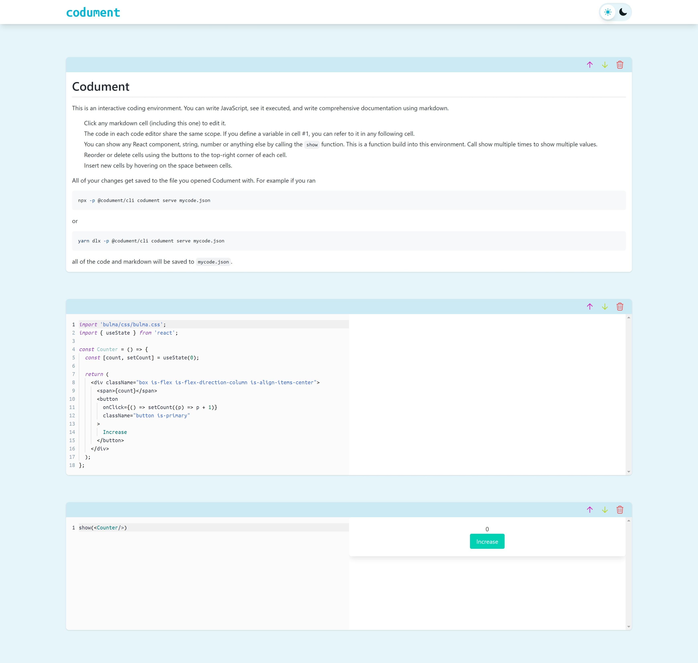
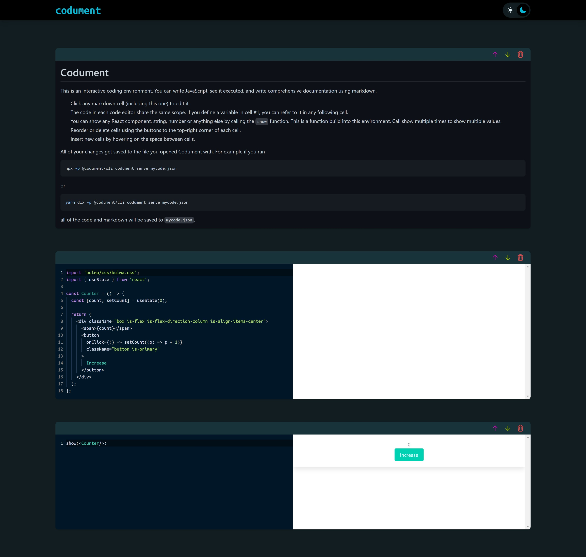

# Codument

Launch and serve a code editing environment in your browser.

## Installation

Install `@codument/cli` with npm

```bash
npm install -g @codument/cli
```

## Usage/Examples

If you have installed the package globally, you can run the `codument` command directly

```bash
codument serve
```

If you want to run the command directly without installing, you can use `npx`

```bash
npx -p @codument/cli codument serve
```

Or `yarn`

```bash
yarn dlx -p @codument/cli codument serve [options] [filename]
```

### Arguments

`filename` - (optional) path of file to load. If omitted, the filename `notebook.json` will be used.

### Options

`-p`, `--port` - (optional) port to run server on. (default 3000)

## Features

- Light/dark mode toggle
- Live previews
- Fullscreen mode
- Cross platform

## Screenshots

### Light Mode



### Dark Mode



## License

[MIT](LICENSE)
